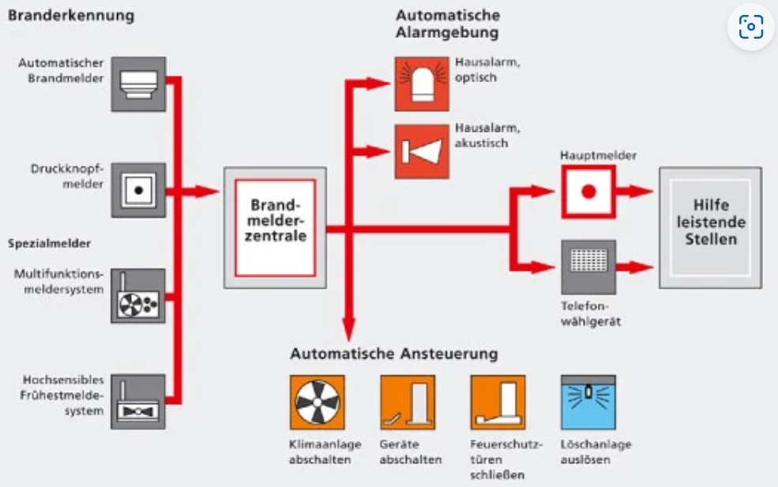

# Szenario: Brandmeldeanlage (Abk. BMA)

# Herausforderung
Bei aktuell den meisten eingesetzten Brandmeldeanlagen gibt es nur die Information Anlage hat ausgelöst oder nicht.
Für die BOS Organisationen ist es hilfreich schon frühzeitig erkenntnisse über die tatächliche ausgelösten Anlagen eine Information zu erhalten.

# Idee
1. Brandmeldeanlage löst aus und läuft in einer aufgeschalteten Leitstelle auf.
Es erfolgt ein Voralarm der betreffenden Feuerwehreinheiten zu diesem Zeitpunkt noch ohne weiterführende Informationen im Detail

2. Danach recherchiert oder erhält der Disponent sofort oder auf Abfruf weiterführende Informationen der BMA.

    - Wieviele Rauchmelder wurden ausgelöst?
    - Wurde ein Handdruckmelder ausgelöst?
    - Gibt es einen Notruf via Telefon zusätzlich

3. Interne Objektinformationen werden abgerufen (interne Feuerwehrpläne der Kommune)
    - Alarm und Einsatzpläne
    - Laufpläne des Objektes zu den einzelnen Rauchmeldern.

4. Zusammenstellung aller Informationen und Übergabe an die alarmierten Einheiten zur Darstellung auf den entsprechenden Einsatztablets. Zusätzlich werden die weiterführenden Infos aus dem Firelake zum Einsatz angezeigt.

# Vorteile
Bei der Anfahrt kann der Fahrzeugführer / Einsatzleiter eine etwaige Einsatzkritikalität erkennen
Beispiele - Ampelsystem 🚦

- 🔴 : mehrere automatische Rauchmelder in einer Folge + Handdruckmelder hohe Kritikalität
- 🟡 : mehrere Rauchmelder in einer Folge --> Feuer/Rauch hat sich bereits auf mehrere Bereich verteilt
- 🟢 : einzelner Rauchmelder --> in der Regel kleineres Ereignis oder Fehlalarm

Je nach Ampelstellung können hieraus bereits frühzeitig Nachalarme oder vorbereitende Maßnahmen getroffen werden.

# Lösungsidee:
Durch neuartige Übertragungeinheiten könnte das Feuerwehr Einsatztableau auf das Display des Einsatzeinleiters / ELWs gespiegelt werden.
Frühere Übertragungseinheiten konnten bisher nur die generelle Auslösung weitermelden ohne weitere Informationen zur Anlage.