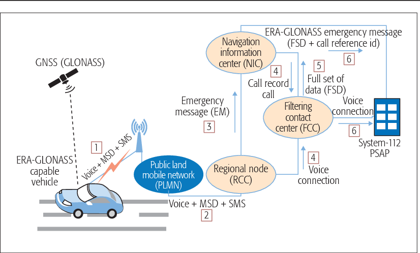

# Technologie
Car2x ist eine Schnittstelle die von Fahrzeugen angeboten wird.
Man unterscheidet Schnittstellen im lokalen Umfeld
und Schnittstellen über das Mobilfunknetz.

Ziel des Systems ist es, Daten mit Infrastruktur und anderen Verkehrsteilnehmern auszutauschen.
Dadurch wird die Verkehrssicherheit und der Komfort erhöht.
Einige der Anwendungsfälle werden hier kurz dargestellt:

* ESP-Eingriffe warnen den nachfolgenden Verkehr vor glatter Fahrbahn
* Ampeln geben nahendem Verkehr Empfehlungen zu Wartezeiten und Geschwindigkeit für eine grüne Welle
* Platooning von Fahrzeugen für eine energiesparende Fahrweise
* Rettungsfahrzeuge können lokal eine Rettungsgasse anfordern

Aus den verfügbaren Daten ergeben sich auch für die Feuerwehr Anwendungspotentiale.

Bildquelle: [Semantic Scholar](https://www.semanticscholar.org/paper/In-Vehicle-Emergency-Call-Services%3A-eCall-and-%C3%96%C3%B6rni-Goulart/484c613f1736c9dfbc862a546428c831156d3562)

# Anwendungsfälle

Generell lassen sich vorhersagende und einsatzrelevante Anwendungsfälle unterscheiden.
Vorhersagend lassen sich Einsatzwahrscheinlichkeiten bestimmen,
einsatzrelevante Informationen können den disponierten Kräften helfen.

## Vorhersagend

* Viele ESP-Eingriffe auf einer Strecke erhöhen die Wahrscheinlichkeit für einen Unfall
* Unfallmeldungen und Warnungen an andere Verkehrsteilnehmer (unabh. vom E-Call)
* Aktivierte Nebelscheinwerfer, Scheibenwischer auf hoher Intensität, viele Bremsvorgänge an der gleichen Stelle können auch als Indikator dienen

## Einsatzrelevant

* Durch Stau-Ereignisse sind Anfahrsrouten verzögert
* Manche Strecken sind gefährlich (Glatt, Nebel, ...)
* Die Einsatzstelle lässt sich Anhand des Verkehrsflusses besser ermitteln

# Grundvoraussetzungen
Die Daten müssen natürlich am System ankommen.
Dies kann über verschiedene Schnittstellen erfolgen, zB

* Fahrzeuge melden Informationen an das Flotten-Backend des OEM -> Schnittstelle zu den OEM Backends erforderlich
* Fahrzeuge melden Informationen über ad-hoc Netzwerke -> Infrastruktur muss an das System angebunden werden